**higgs is a self-contained local LLM runtime in Rust.** Point it at a folder of
GGUF files and it serves OpenAI-compatible inference over HTTP — embedded in your
own Axum app or as a standalone binary — with crash-isolated worker processes, a
pluggable engine layer, and an optional peer-to-peer **remote fleet** that runs
models on other machines over an encrypted QUIC link.

```mermaid
flowchart LR
  subgraph clients["&nbsp;CLIENTS&nbsp;"]
    direction TB
    oai["OpenAI client<br/><small>/v1/chat/completions · /v1/models</small>"]
    ui["Admin / UI<br/><small>/api/higgs/*</small>"]
  end

  subgraph host["&nbsp;HIGGS HOST PROCESS &nbsp;·&nbsp; pure Rust, crash-proof control plane&nbsp;"]
    direction TB
    router{{"Axum router<br/><small>/v1 + /api/higgs</small>"}}
    facade["<b>Higgs</b> facade<br/><small>load · chat · status · logs · scan</small>"]
    sup["Supervisor<br/><small>spawn · restart · replay</small>"]
    fleet["HubFleet<br/><small>routes: model → node, worker</small>"]
    router --> facade
    facade -->|local| sup
    facade -->|remote| fleet
  end

  subgraph wproc["&nbsp;WORKER PROCESS &nbsp;·&nbsp; spawned on load&nbsp;"]
    worker["llama.cpp engine<br/><small>HiggsEngine (native FFI)</small>"]
  end

  subgraph remote["&nbsp;REMOTE NODE &nbsp;·&nbsp; another machine&nbsp;"]
    direction TB
    nrt["NodeRuntime<br/><small>N concurrent workers</small>"]
    rworker["worker · llama.cpp"]
    nrt --> rworker
  end

  gguf[("GGUF<br/>on disk")]
  rgguf[("GGUF<br/>on node disk")]

  oai e1@-->|HTTP| router
  ui e2@-->|HTTP| router
  sup e3@-->|"stdio JSON-RPC"| worker
  worker --> gguf
  fleet e4@==>|"iroh QUIC · encrypted P2P"| nrt
  rworker --> rgguf

  e1@{ animate: true }
  e2@{ animate: true }
  e4@{ animate: true }

  classDef pure fill:#eef2ff,stroke:#6366f1,stroke-width:1.5px,color:#1e1b4b;
  classDef native fill:#fff7ed,stroke:#f59e0b,stroke-width:1.5px,color:#7c2d12;
  classDef store fill:#ecfdf5,stroke:#10b981,stroke-width:1.5px,color:#064e3b;
  classDef client fill:#f1f5f9,stroke:#94a3b8,stroke-width:1.5px,color:#0f172a;
  class oai,ui client;
  class router,facade,sup,fleet,nrt pure;
  class worker,rworker native;
  class gguf,rgguf store;
```



## Why higgs

- **Embeddable, zero-dependency on its host.** higgs imports nothing from the app
  that embeds it. Mount it into any Axum router with one call, or ship the
  standalone `higgs` binary — same surface either way.
- **It can't crash your app.** The native inference engine runs in a *separate
  worker process*. A segfault in llama.cpp kills the worker, not the host; the
  supervisor restarts it and replays the last load.
- **Zero idle cost.** With no model loaded there is no worker process and no model
  RAM — higgs spawns on load and reaps on unload (and on idle).
- **It speaks OpenAI verbatim.** Existing OpenAI SDKs and tools point at higgs
  unchanged — streaming, tool calling, usage accounting included.
- **It scales past one box.** Pair other machines and route inference to their
  GPUs over an encrypted QUIC link, with no central server and no open inbound
  ports required.

## What it can do

### Inference
- OpenAI-compatible `POST /v1/chat/completions` — **streaming (SSE)** and non-streaming.
- `GET /v1/models` listing (local *and* remotely-routable models).
- Sampling: per-request generation applies **`temperature`** and the max-token
  budget (`max_tokens` / `max_completion_tokens`). Other OpenAI fields (`top_p`,
  presence / frequency penalties) are accepted and range-validated for
  compatibility but not yet forwarded to the sampler; `seed` is a load-time
  parameter; `stop` strings aren't applied yet.
- **Tool / function calling**: the GGUF-embedded chat template renders the OpenAI
  `tools` array, and the matching tool-call parser is selected automatically — no
  bespoke format is invented. Multi-turn tool loops round-trip
  (`assistant.tool_calls` → `tool` results).
- Usage accounting (`prompt_tokens` / `completion_tokens`), including
  `stream_options.include_usage`.

### Model management
- Host-side discovery across **LM Studio**, **HuggingFace cache**, and **Ollama**
  layouts — works even with no worker running.
- **Spawn-on-load / kill-on-unload**: zero model loaded ⇒ zero worker ⇒ zero idle RAM.
- **Just-in-time load**: a chat for a scanned-but-unloaded model loads it on demand.
- **Idle reaper**: auto-unloads a model after a configurable idle TTL.
- Pre-load **RAM headroom guard** — a model that can't fit is rejected before it
  thrashes the host. (Total/free VRAM is also reported and a `fits_vram` helper is
  provided, though the enforced pre-load check is RAM-based.)
- **Model-support detection**: a transient probe worker validates a GGUF's header
  and architecture (a `vocab_only` load — it won't catch a tensor/quant mismatch),
  and host-side parsing confirms its tool dialect — cached per
  `(arch, quant, engine_version)`.
- Rich load tuning: `ctx_len`, `gpu_layers`, `threads`, mmap / mlock, batch sizes,
  KV-cache type, flash-attention.

### Reliability & isolation
- The inference engine runs in a **separate worker process** (a re-exec of the
  host binary with `--higgs-worker`) — a worker crash can never take down the host.
- The **supervisor** restarts a crashed worker once and **replays the last load**,
  so the model self-heals.
- A pure-Rust control plane (router + facade); only the worker touches native FFI.

### Observability
- Unified **Developer Logs**: worker stderr + serve-layer tracing in one `LogBus`.
- `GET /api/higgs/logs` snapshot tail and `GET /api/higgs/logs/stream` live SSE.
- `?source=` filter: `serve`, `worker`, or a remote worker `node:<id>:<worker>`.
- `GET /api/higgs/system` — real CPU / RAM / GPU / VRAM plus engine & runtime versions.

### Remote fleet (peer-to-peer)
- Run models on **other machines** over an encrypted [iroh](https://iroh.computer)
  QUIC link — no central server, no open inbound ports required.
- **Pairing** with one-time tokens + a persistent allowlist and a
  version-negotiated handshake.
- The hub routes `/v1` chat to a remote-resident worker transparently — always two
  hops: hub → node → worker.
- **Durable routes** survive reconnects; a worker-gone error drops the stale route
  so a later explicit load can recover it.
- **Remote model pull** (node-side protocol plumbing): the node implements
  `M_NODE_PULL` to download a GGUF from HuggingFace into its own models directory
  with streamed progress — though the hub-side caller / HTTP trigger to invoke it
  is not yet wired (see [Remote Fleet](/remote-fleet/#remote-model-pull)).
- Remote worker stderr is **relayed back** into the hub's log console, tagged per
  node and worker.
- `GET /api/higgs/nodes` — fleet view: each node's identity, connection state,
  hardware, and resident workers.

### Security
- The HTTP surface is **open by default** (built for loopback / embedded use) and
  becomes **API-key gated** the moment the first key is added — Bearer tokens with
  `chat` / `models` / `admin` scopes, stored only as SHA-256 digests.
- Browser-facing hardening: a DNS-rebinding **Host guard**, CORS, body limits, and
  panic recovery — plus a loud warning on any non-loopback bind.

### Extensibility
- A single [`HiggsEngine`](/system-design/#engine-trait) trait is the only seam
  between higgs and an inference backend. Adding a new engine (e.g. MLX) is
  *implement the trait + one registry line* — selected at startup via `HIGGS_ENGINE`.

## How it fits together

higgs keeps the control plane and the native engine in **separate processes**:

```
host process (your app, or the `higgs` binary)
│
│  Arc<Higgs>            ← pure Rust: router, facade, model scan, log bus
│     │ load(model)
│     ▼
│  Supervisor  ──spawn──>  worker process ("higgs(<model>)")
│     │   newline-delimited JSON-RPC 2.0 over stdio       │
│     │   M_LOAD / M_CHAT / M_STATUS / M_SYSINFO          │  HiggsEngine (llama.cpp FFI)
│     │<──────── N_CHAT_CHUNK stream + final ────────────┤
│     ▼                                                    ▼
│  restart-on-crash + replay last load               GGUF on disk
```

One Axum router exposes two surfaces — the OpenAI-compatible `/v1/*` and the
control `/api/higgs/*` — and the same `Higgs` facade backs both, whether a model
is local or routed to a remote node.

## Where to go next

- **[System Design](/system-design/)** — the single-node design in depth: worker
  model, engine trait, model scan, support detection, tool calling, logs, security.
- **[Remote Fleet](/remote-fleet/)** — the distributed design: pairing, two-hop
  routing, multi-worker nodes, durable routes, and model pull.
- **[How to Use](/how-to-use/)** — scan → load → chat walkthrough and troubleshooting.
- **[Endpoints](/endpoints/)** — the full HTTP API reference.
- **[Development](/development/)** — quality gate, formatting, and coverage.
